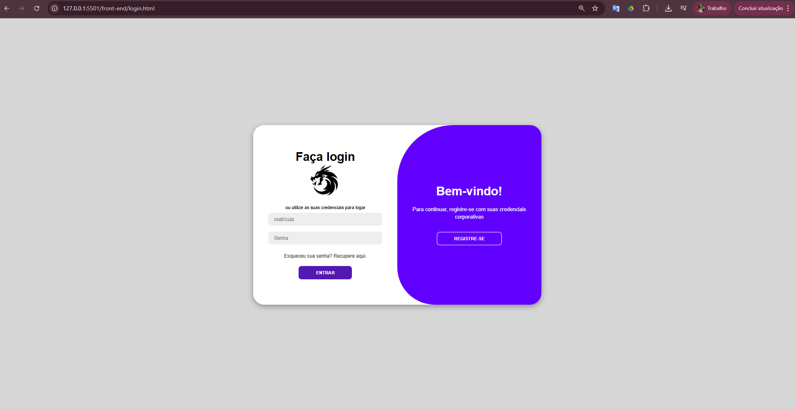
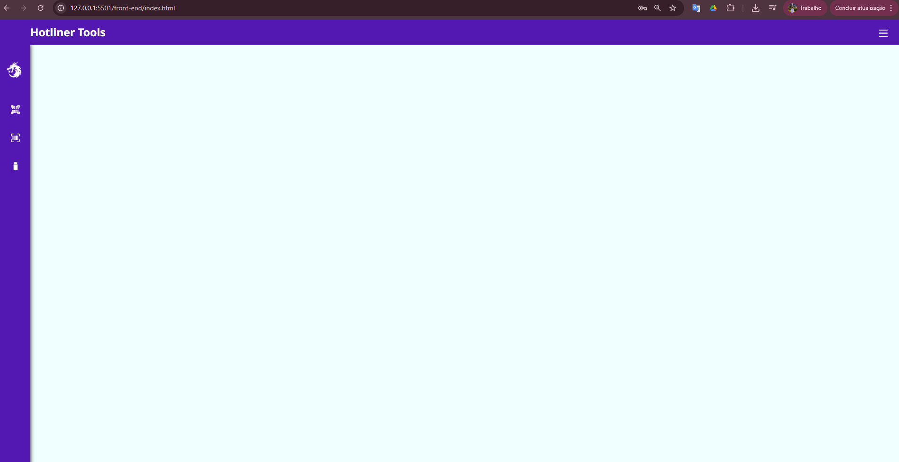
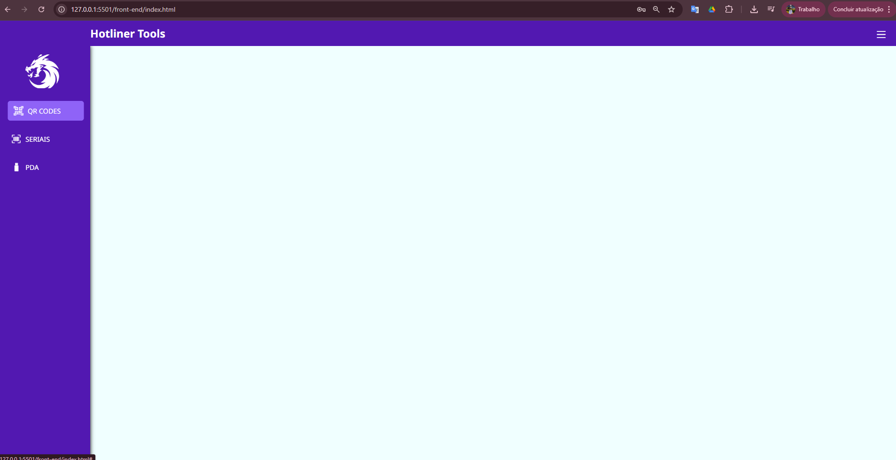
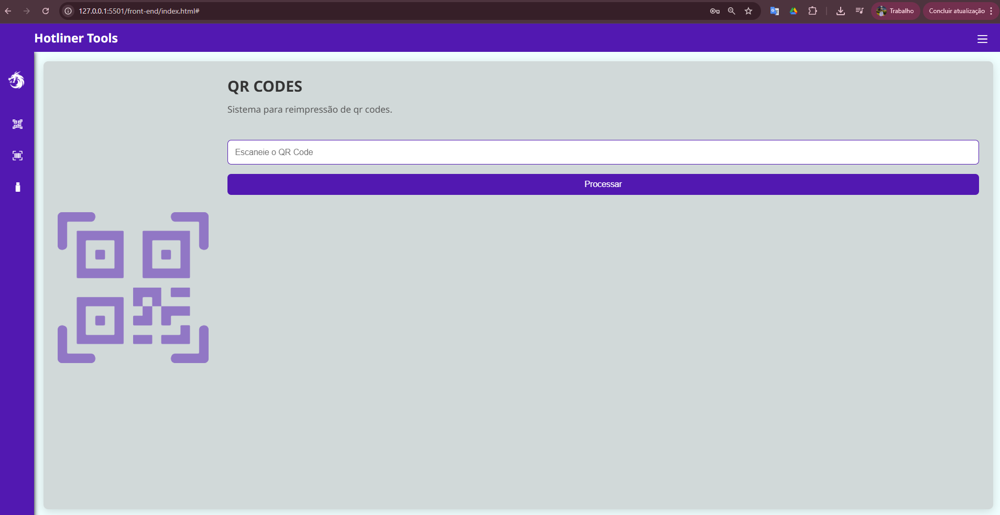
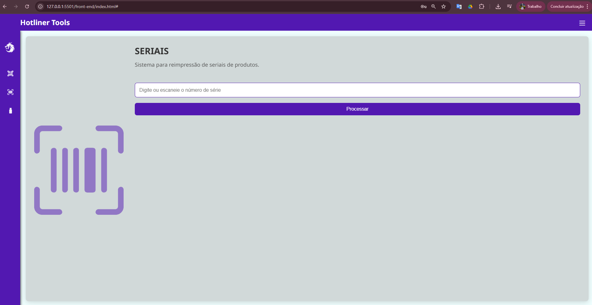
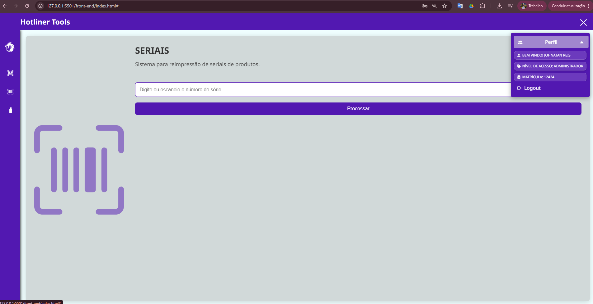

# 📦 Sistema de Reimpressão de Seriais e QR Codes

Esta aplicação web foi desenvolvida para uso interno em ambiente industrial, com o objetivo de **gerenciar a reimpressão de QR Codes e seriais na linha de produção**. A interface permite excluir registros e atualizar dados no banco de forma prática, rápida e segura.

---

## 🚀 Funcionalidades

### 🔹 Aba QR Code

- 🔍 Verificação de QR Codes no banco.
- ❌ Exclusão de registros para liberar reimpressão.

### 🔹 Aba Seriais

- 🔍 Verificação de seriais.
- 🔁 Atualização de OS (Ordem de Serviço).
- 🔄 Alteração do STATUS para "LIVRE" ou "CONSUMIDO".
- 🔧 Reimpressão de seriais ajustados.

---

## 🧱 Estrutura do Projeto

```
.
├── back-end
│   ├── controllers
│   ├── middlewares
│   ├── routes
│   ├── services
│   ├── .env
│   ├── server.js
├── front-end
│   ├── src
│   │   ├── css
│   │   ├── js
│   │   └── img
│   ├── index.html
│   ├── login.html
```

---

## 💻 Tecnologias Utilizadas

### 🖼️ Front-end

- **HTML5**
- **CSS3**
  - Animações customizadas
  - Estilização responsiva e limpa
- **JavaScript Vanilla**
  - Renderização dinâmica com `innerHTML`
  - Manipulação de eventos e DOM
  - UX aprimorada com animações JS

### 🔧 Back-end

- **Node.js**
- **Express.js**
- **CORS**
- **dotenv**
- **bcrypt**
- **jsonwebtoken**
- **mysql2**

## 🖼️ Interface da Aplicação

### Login Screen



### Home interface



### Home sidebar collapsed



### Interface rendered QR card



### Interface rendered serial card



### Dropdown collapsed menu



### 🛠️ Ferramentas de Desenvolvimento

- **VS Code** (IDE)
- **DBeaver** (Interface gráfica para o banco de dados)
- **Insomnia** (testes das APIs)

---

## 🔐 Autenticação

O sistema conta com controle de acesso via **JWT (JSON Web Token)**, protegendo rotas sensíveis da aplicação.

---

## 🗃️ Banco de Dados

- **MySQL**

---

## 📁 Modularidade

A estrutura do projeto foi organizada de forma modular:

- **Separação por controllers, rotas e serviços no back-end**.
- **Scripts JS independentes para cada comportamento no front** (event listeners, renderização, animações).
- **Estilo encapsulado por contexto** em arquivos `.css` específicos por funcionalidade.

---

## 🧪 Como Executar o Projeto

### 1. Clone o repositório

```bash
git clone https://github.com/seu-usuario/seu-repositorio.git
cd seu-repositorio
```

### 2. Instale as dependências do back-end

```bash
cd back-end
npm install
```

### 3. Configure o arquivo `.env`

Crie um `.env` com as seguintes variáveis:

```env
PORT=3000
DB_HOST=localhost
DB_USER=seu_usuario
DB_PASSWORD=sua_senha
DB_NAME=nome_do_banco
JWT_SECRET=chave_secreta
```

### 4. Inicie o servidor

```bash
npm start
```

### 5. Acesse a aplicação

Abra o arquivo `index.html` dentro da pasta `front-end` no navegador ou configure um servidor local.

---

## ✨ Diferenciais

- Interface moderna e fluida.
- Experiência do usuário (UX) otimizada.
- Código limpo e comentado.
- Pronto para produção em ambiente industrial.

---

## 📩 Contato

Caso precise de suporte ou queira contribuir, entre em contato:

**Autor:** Johnatan Dos Santos Reis  
📧 [johnatan.reiiss@icloud.com]
📧 [johnatan.reis@grupomulti.com.br]
📧 [linkedin.com/in/johnatan-Reis](https://www.linkedin.com/in/johnatan-dos-santos-reis-945092b7/)
📧 [github.com/JohnReiiss](https://github.com/JohnReiiss)

---
